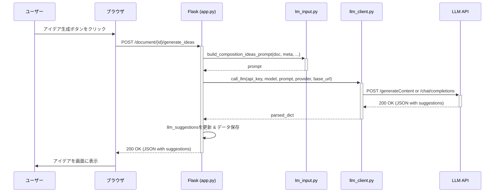
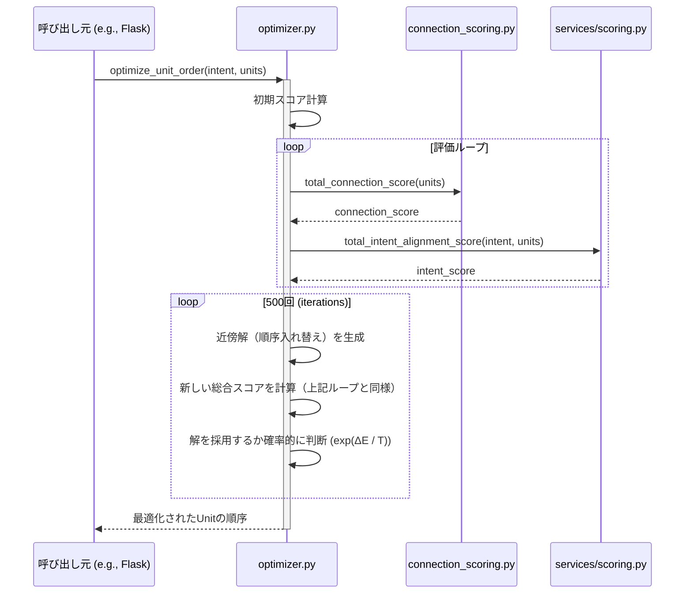

# システム詳細仕様書 - Otsumonogatari (v2)

## 1. システム概要

本システム「Otsumonogatari」は、生成AIと最適化アルゴリズムを融合させた、物語・論文・ブログ記事等の創作活動を支援するWebアプリケーションである。ユーザーは創作物の種類（小説、論文等）と自身の創作意図（Intent）を入力することで、AIによる構成要素の提案や、それらの最適な組み合わせの算出といった支援を受けることができる。

- **目的**: 創作プロセスにおける構造化とアイデア創出を自動化・効率化し、クリエイターの生産性向上に貢献する。
- **主要機能**:
    - ドキュメント管理（作成、保存、JSON形式でのアップロード・ダウンロード）
    - 創作意図（Intent）の動的な定義と管理
    - AIによる構成要素（キャラクター、シーン、論点等）のアイデア生成
    - 擬似アニーリングによる構成単位（Unit）の順序最適化
    - ユーザーごとのLLMプロバイダ設定（Gemini, ChatGPT, その他OpenAI互換API）
- **技術スタック**:
    - **バックエンド**: Python, Flask
    - **フロントエンド**: HTML, CSS, JavaScript
    - **データベース**: SQLite (ユーザー認証情報のみ)
    - **データストレージ**: ユーザーごとのJSONファイル (`user_data/{user_id}/working.json`)
    - **主要ライブラリ**:
        - `google-generativeai`: Google Gemini API連携
        - `openai`: OpenAI API連携 (ChatGPTおよびその他互換API)
        - `Flask`: Webフレームワーク

## 2. モジュール仕様

### 2.1. 主要モジュール

| ファイル名 | 役割 | 主要な関数・ロジック |
| :--- | :--- | :--- |
| `app.py` | **Webアプリケーション本体** | Flaskアプリケーションのインスタンス化、全URLのルーティング、ビューのレンダリング。認証、ドキュメント操作、AI連携など、システム全体のハブとして機能する。 |
| `auth.py` | **認証管理** | ログイン処理、セッション管理を担当。`db.py`と連携し、ユーザー情報の検証を行う。 |
| `db.py` | **データベース初期化** | システム起動時にSQLiteデータベースと`users`テーブルを初期化する。ユーザー認証情報のみを管理する。 |
| `models.py` | **ドメインモデル定義** | `Document`, `Unit`, `Entity`, `Intent`といった、システムの中核となるデータ構造を`dataclass`で定義。主に最適化やスコアリングロジックで利用される概念モデル。 |
| `user_files.py` | **ユーザーデータ永続化** | ユーザーごとのドキュメントデータ全体を単一のJSONファイル (`working.json`) としてファイルシステムに保存・読み込みを行う。 |
| `intent_service.py` | **創作意図（Intent）サービス** | ドキュメントの種別（`doc_type`）に基づき、適切な創作意図のテンプレートを生成・正規化する。 |
| `services/services.py` | **コアビジネスロジック** | ドキュメントのCRUD操作、構成要素の正規化と更新、LLMプロンプトの構築など、アプリケーションの主要なロジックを実装。 |
| `services/llm_client.py` | **LLM APIクライアント** | `llm_provider`設定（gemini, chatgpt, other）に応じて、Google GeminiまたはOpenAI互換APIを呼び出すためのクライアント。 |
| `optimizer.py` | **構成順序最適化エンジン** | **擬似アニーリング（Simulated Annealing）**アルゴリズムを用い、構成単位（`Unit`）の最適な順序を探索する。 |
| `connection_scoring.py`| **接続スコアリング** | 2つの構成単位（Unit）間の接続の良さをJaccard類似度などを用いて評価する。 |
| `security.py` | **セキュリティ** | パスワードのハッシュ化および検証機能を提供する。 |
| `ui_labels.py` | **UIラベル定義** | ドキュメント種別に応じたUI上のラベル（例：「シーン」「キャラクター」）を定義する。 |
| `intent_templates.json`| **創作意図テンプレート** | 新規ドキュメント作成時に適用される、創作意図の初期フィールドをJSON形式で定義する。 |
| `composition_meta.json`| **構成要素メタデータ** | AIが生成する構成要素のカテゴリや構造のデフォルト設定をJSON形式で定義する。 |

### 2.2. 最適化・生成AIプロンプト制御

#### 2.2.1. 構成順序最適化ロジック (`optimizer.py`)

古典的な最適化手法である**擬似アニーリング (Simulated Annealing)** を用いて、構成単位の最適な順序を探索する。

**ロジック詳細:**
1.  **評価関数 `total_story_score`**:
    - 物語全体の「良さ」を、以下の2つのスコアの重み付き和で計算する。
        - `total_intent_alignment_score`: 物語全体がユーザーの創作意図にどれだけ沿っているか。
        - `total_connection_score`: 各構成単位がスムーズに繋がっているか。
2.  **最適化プロセス `optimize_unit_order`**:
    - 現在の順序を初期解とする。
    - 反復処理の中で、ランダムに2つの`Unit`を入れ替えた「近傍解」を生成。
    - スコアが改善すれば解を更新。スコアが悪化した場合でも、温度パラメータ`T`に基づく確率`exp(ΔE / T)`で解を更新し、局所最適解からの脱出を図る。
    - 温度`T`を徐々に下げていき、解を収束させる。

#### 2.2.2. 生成AIプロンプト制御ロジック (`lm_input.py`, `app.py`)

`generate_composition_ideas`エンドポイントにて、LLMへのプロンプトを動的に生成する。

**ロジック詳細:**
1.  **コンテキスト構築**:
    - 対象ドキュメントの「創作意図 (Intent)」および既存の「構成要素 (Composition Elements)」をすべて取得し、構造化されたテキストとしてプロンプトに埋め込む。
    - `composition_meta.json`の構造に基づき、生成対象のカテゴリ（例：「キャラ案」）を指定する。
2.  **出力形式の指示**:
    - プロンプトの末尾で、厳密な**JSON形式**（例：`{"suggestions": [{"category_id": "character", "elements": ["アイデア1"]}]}`）での出力を要求する。
3.  **API呼び出し**:
    - `services/llm_client.py`の`call_llm`関数が、ユーザーセッションの`llm_provider`設定に応じて適切なAPI（Gemini/OpenAI互換）を呼び出す。
    - レスポンスとして得られたJSON文字列をパースし、フロントエンドに返す。
    - 生成されたプロンプトとレスポンスは、デバッグ目的で`user_data/{user_id}/`以下に一時ファイルとして保存される。

## 3. フローチャート

### 構成要素アイデア生成フロー

```mermaid
graph TD
    subgraph "ユーザー操作"
        A[1. アイデア生成ボタンをクリック] --> B{2. is_first_category_in_session?};
    end

    subgraph "バックエンド処理 (Flask: app.py)"
        B -- Yes --> C[古い生成ファイルを削除 & カウンタをリセット];
        B -- No --> D;
        C --> D[app.py: /generate_ideas];
        D --> E[lm_input.py: build_composition_ideas_prompt];
        E --> F[services/llm_client.py: call_llm];
    end

    subgraph "外部API"
        F -- providerに応じて分岐 --> G[Gemini API];
        F -- providerに応じて分岐 --> H[OpenAI互換 API];
        G -- JSONレスポンス --> I;
        H -- JSONレスポンス --> I;
    end

    subgraph "バックエンド処理 (Flask: app.py)"
        I[レスポンスをパース] --> J[app.py];
        J --> K[生成プロンプトとレスポンスをファイル保存];
        K --> L[documentのllm_suggestionsを更新];
        L --> M[user_files.py: save_user_data];
        M --> N[提案リスト(JSON)をブラウザに返す];
    end

    subgraph "ユーザー操作"
      N --> O[5. 提案されたアイデアを画面に表示];
    end
```

## 4. データ仕様

### 4.1. データベーススキーマ (SQLite)

- **テーブル名**: `users` ( `users.db` ファイルに保存)
- **目的**: ユーザー認証情報のみを永続化する。創作データはJSONファイルに保存される。

| カラム名 | 型 | 説明 |
| :--- | :--- | :--- |
| `id` | INTEGER | 主キー |
| `email` | TEXT | ユーザーのメールアドレス（UNIQUE） |
| `password_hash`| TEXT | ハッシュ化されたパスワード |
| `created_at` | DATETIME | アカウント作成日時 |

### 4.2. JSONファイル仕様

#### 4.2.1. ユーザーデータ (`user_data/{user_id}/working.json`)

ユーザーが作成した全ドキュメントを格納する単一のファイル。

| プロパティ | 型 | 説明 |
| :--- | :--- | :--- |
| `documents`| Array<Object> | ユーザーが作成したドキュメントの配列 |
| `documents[].id`| String | ドキュメントの一意なID (16進数) |
| `documents[].title` | String | ドキュメントのタイトル |
| `documents[].doc_type`| String | ドキュメントの種類（例: "小説", "論文"） |
| `documents[].intent`| Object | 創作意図。`intent_templates.json`に基づき生成され、ユーザーが編集可能。 |
| `documents[].composition_elements`| Object | 構成要素。`composition_meta.json`に基づき生成され、ユーザーが編集可能。 |
| `documents[].units`| Array<Object> | 物語を構成する個別の単位（シーン等）。`composition_elements`の`scene`カテゴリと同期される。 |
| `documents[].llm_suggestions` | Array<Object> | LLMから提案されたアイデアの一時的な保持場所。 |

#### 4.2.2. 創作意図テンプレート (`intent_templates.json`)

ドキュメント種別ごとに、創作意図の初期フィールドを定義する。

| プロパティ | 型 | 説明 |
| :--- | :--- | :--- |
| `common_intents` | Array<Array<String>> | 全ての`doc_type`に共通する意図の定義。`[key, label]`の形式。 |
| `doc_type_intents` | Object | `doc_type`ごとの固有の意図の定義。キーが`doc_type`名。 |

#### 4.2.3. 構成要素メタデータ (`composition_meta.json`)

ドキュメントの構造や構成要素のカテゴリを定義する。

| プロパティ | 型 | 説明 |
| :--- | :--- | :--- |
| `common_categories` | Object | 全`doc_type`に共通する構成要素カテゴリの定義。 |
| `doc_types` | Object | `doc_type`ごとの固有の構成要素カテゴリの定義。 |
| `doc_types.{doc_type}.categories[].id` | String | カテゴリID（例: "scene", "character"）。 |
| `doc_types.{doc_type}.categories[].elements`| Array<Object>| カテゴリに含まれる初期要素の定義。 |

## 5. インタフェース仕様

### 5.1. APIエンドポイント

| エンドポイント | メソッド | 認証 | 説明 |
| :--- | :--- | :--- | :--- |
| `/` | GET | 不要 | `/login`にリダイレクト |
| `/login` | GET, POST | 不要 | ログイン処理 |
| `/register`| GET, POST | 不要 | 新規ユーザー登録 |
| `/logout` | GET | 要 | ログアウト処理 |
| `/dashboard` | GET | 要 | ドキュメント一覧ダッシュボードの表示 |
| `/save_config` | POST | 要 | ユーザーのLLMプロバイダ、APIキー等の設定を保存 |
| `/upload` | POST | 要 | 既存のドキュメント（JSON形式）をアップロード |
| `/document/create` | POST | 要 | 新規ドキュメントを作成 |
| `/document/<doc_id>`| GET, POST | 要 | ドキュメントの表示、構成単位（Unit）および構成要素（Composition Elements）の更新 |
| `/document/<doc_id>/intent`| POST | 要 | 創作意図（Intent）の更新（項目の追加・削除・値の変更） |
| `/document/<doc_id>/generate_ideas` | POST | 要 | LLMを使用して構成要素のアイデアを非同期で生成 |
| `/document/<doc_id>/add_composition_element`| POST | 要 | AIが提案したアイデアを構成要素としてドキュメントに追加 |
| `/document/<doc_id>/download`| GET | 要 | ドキュメントをJSONファイルとしてダウンロード |

### 5.2. 外部API連携

- **対象API**: Google Gemini API, OpenAI API (および互換API)
- **連携モジュール**: `services/llm_client.py`
- **認証方式**: HTTPヘッダー `Authorization: Bearer <API_KEY>`
    - APIキーはユーザーがフロントエンドから設定し、サーバーサイドのセッションに保存される。
- **リクエスト**:
    - **形式**: JSON
    - **主要パラメータ**: `model`, `prompt`/`messages`
- **レスポンス**:
    - **期待する形式**: アプリケーション側で定義したスキーマに準拠したJSONオブジェクト（例：`{"suggestions": [...]}`）。

## 6. シーケンス図

### 6.1. AIによる構成要素アイデア生成



### 6.2. 構成順序の最適化（擬似アニーリング）

※ 現状、この処理を呼び出すためのUI上のボタンやエンドポイントは直接的には実装されていないが、バックエンドのロジックは`optimizer.py`に存在する。


