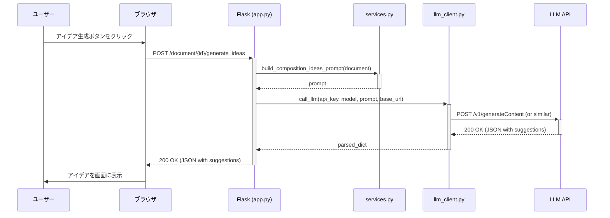
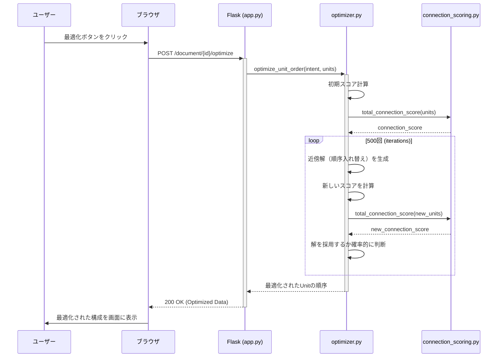

# システム詳細仕様書 - Otsumonogatari

## 1. システム概要

本システム「Otsumonogatari」は、生成AIと最適化アルゴリズムを融合させた、物語・論文・ブログ記事等の創作活動を支援するWebアプリケーションである。
ユーザーは創作物の種類（小説、論文等）と自身の創作意図（Intent）を入力することで、AIによる構成要素の提案や、それらの最適な組み合わせの算出といった支援を受けることができる。

- **目的**: 創作プロセスにおける構造化とアイデア創出を自動化・効率化し、クリエイターの生産性向上に貢献する。
- **主要機能**:
    - ドキュメント管理（作成、保存、入出力）
    - 創作意図（Intent）の定義と管理
    - AIによる構成要素（キャラクター、シーン、論点等）のアイデア生成
    - 擬似アニーリングによる構成要素の順序最適化
    - ユーザー設定（APIキー等）の管理
- **技術スタック**:
    - **バックエンド**: Python, Flask
    - **フロントエンド**: HTML, CSS, JavaScript
    - **データベース**: SQLite
    - **主要ライブラリ**:
        - `google-generativeai`: Google Gemini API連携
        - `openai`: OpenAI API連携
        - `Flask`: Webフレームワーク

## 2. モジュール仕様

### 2.1. 主要モジュール

| ファイル名 | 役割 | 主要な関数・ロジック |
| :--- | :--- | :--- |
| `app.py` | **Webアプリケーション本体** | Flaskアプリケーションのインスタンス化、ルーティング定義、ビューのレンダリングを行う。認証、ドキュメント操作、AI連携など、システム全体のハブとして機能する。 |
| `auth.py` | **認証管理** | ログイン、ログアウト、セッション管理を担当する。`db.py`と連携し、ユーザー情報の検証を行う。 |
| `db.py` | **データベース初期化** | システム起動時にSQLiteデータベースと`users`テーブルを初期化する。 |
| `models.py` | **ドメインモデル定義** | `Document`, `Unit`, `Entity`, `Intent`といった、システムの中核となるデータ構造を`dataclass`を用いて定義する。これらは永続化されるデータではなく、処理中のオブジェクトモデルとして利用される。 |
| `user_files.py` | **ユーザーデータ永続化** | ユーザーごとのドキュメントデータをJSONファイルとしてファイルシステムに保存・読み込みを行う。ユーザーIDごとにディレクトリが作成される。 |
| `intent_service.py` | **創作意図（Intent）サービス** | ドキュメントの種別（`doc_type`）に基づき、適切な創作意図のテンプレートを生成・正規化する。 |
| `services/services.py` | **コアビジネスロジック** | ドキュメントのCRUD操作、構成要素の更新、LLMに渡すプロンプトの構築など、アプリケーションの主要なビジネスロジックを実装する。 |
| `services/llm_client.py` | **LLM APIクライアント** | Google GeminiおよびOpenAIのAPIを呼び出すためのクライアント。モデル名に応じて適切なクライアントに処理を振り分ける。APIキーとベースURLはユーザーセッションから取得される。 |
| `optimizer.py` | **構成順序最適化エンジン** | **擬似アニーリング（Simulated Annealing）**アルゴリズムを用いて、物語の構成単位（`Unit`）の最適な順序を探索する。全体のスコアは「創作意図との整合性スコア」と「構成単位間の接続スコア」の重み付き和によって計算される。 |
| `connection_scoring.py`| **接続スコアリング** | 2つの構成単位（Unit）間の接続の良さを評価するスコアを算出する。テキスト間のJaccard類似度や、トピックの連続性を評価するロジックが含まれる。 |
| `security.py` | **セキュリティ** | パスワードのハッシュ化など、基本的なセキュリティ機能を提供する。 |
| `ui_labels.py` | **UIラベル定義** | ドキュメント種別に応じたUI上のラベル（例：「シーン」「キャラクター」）を定義する。 |
| `intent_templates.json`| **創作意図テンプレート** | ドキュメント種別ごとに、創作意図を定義するためのフィールド（例：「ジャンル」「テーマ」）をJSON形式で定義する。 |
| `composition_meta.json`| **構成要素メタデータ** | AIが生成する構成要素（シーン案、キャラ案など）のカテゴリや構造をJSON形式で定義する。 |

### 2.2. 量子アルゴリズム・生成AIプロンプト制御

#### 2.2.1. 量子アルゴリズム実装ロジック (`optimizer.py`)

ユーザー要件には「量子アルゴリズム」とあるが、現在の実装 (`optimizer.py`) は古典的な最適化手法である**擬似アニーリング (Simulated Annealing)** を用いている。これは量子アニーリングの概念に触発された組み合わせ最適化問題の近似解法の一つである。

**ロジック詳細:**
1.  **評価関数 `total_story_score`**:
    - 物語全体の「良さ」を評価するスコアを定義する。
    - このスコアは、以下の2つの指標の重み付き和で計算される。
        - `total_intent_alignment_score`: 物語全体がユーザーの創作意図（Intent）にどれだけ沿っているか。
        - `total_connection_score`: 各構成単位（Unit）がスムーズに繋がっているか。
2.  **最適化プロセス `optimize_unit_order`**:
    - `units` の現在の順序を初期解とする。
    - **反復処理**:
        1.  現在の順序からランダムに2つの`Unit`を選び、入れ替えた「近傍解」を生成する。
        2.  近傍解のスコアを `total_story_score` で計算する。
        3.  スコアが改善した場合、その近傍解を次の解として採用する。
        4.  スコアが悪化した場合でも、`exp(ΔE / T)` の確率で解を採用する（`ΔE`: スコアの変化量, `T`: 温度パラメータ）。これにより局所最適解からの脱出を図る。
    - 温度 `T` は反復ごとに徐々に下げていき、最終的に解を収束させる。
    - 最もスコアが高かった順序を最適解として返す。

#### 2.2.2. 生成AIプロンプト制御ロジック (`services/services.py`, `app.py`)

生成AI（LLM）へのプロンプトは、ユーザーの入力とシステムのテンプレートを組み合わせて動的に生成される。

**ロジック詳細 (`generate_composition_ideas` エンドポイント周辺):**
1.  **コンテキスト構築**:
    - 対象ドキュメントの「創作意図 (Intent)」および既存の「構成要素 (Composition Elements)」をすべて取得する。
    - これらの情報を構造化されたテキストとしてプロンプトに埋め込む。
    - 出力形式として、厳密な**JSON形式**（例：`{"suggestions": ["アイデア1", "アイデア2", ...]}`）を指定する。これにより、LLMの応答を安定してパースできるよう制御する。
2.  **指示の付与**:
    - プロンプトの末尾に、どのようなアイデアを生成してほしいか（例：「以下のテーマと設定に基づき、新規性のあるシーンのアイデアを5つ提案してください」）という具体的な指示を追加する。
3.  **API呼び出し**:
    - `services/llm_client.py` の `call_llm` 関数を呼び出し、構築したプロンプトをLLM APIに送信する。
    - レスポンスとして得られたJSON文字列をパースし、フロントエンドに返す。

## 3. フローチャート

### 主要処理フロー（構成要素生成から最適化まで）

```mermaid
graph TD
    subgraph "ユーザー操作"
        A[1. 創作意図の入力] --> B{2. アイデア生成を要求};
    end

    subgraph "バックエンド処理 (Flask)"
        B --> C[app.py: /generate_ideas];
        C --> D[services.py: build_composition_ideas_prompt];
        D --> E[llm_client.py: call_llm];
    end

    subgraph "外部API"
        E --> F[LLM API (Gemini/OpenAI)];
        F -- JSONレスポンス --> E;
    end

    subgraph "バックエンド処理 (Flask)"
        E --> G[JSONをパース];
        G --> H[app.py: 提案リストを返す];
    end

    subgraph "ユーザー操作"
        H --> I[3. 提案されたアイデアを選択・編集];
        I --> J{4. 構成の最適化を要求};
    end

    subgraph "バックエンド処理 (Flask)"
        J --> K[app.py: /optimize_order (仮)];
        K --> L[optimizer.py: optimize_unit_order];
        L -- 評価ループ --> M[connection_scoring.py: total_connection_score];
        M --> L;
        L -- 最適化された順序 --> K;
        K --> N[最適化結果を返す];
    end

    subgraph "ユーザー操作"
      N --> O[5. 最適化された構成を確認];
    end
```

## 4. データ仕様

### 4.1. データベーススキーマ (SQLite)

- **テーブル名**: `users`

| カラム名 | 型 | 説明 |
| :--- | :--- | :--- |
| `id` | INTEGER | 主キー |
| `email` | TEXT | ユーザーのメールアドレス（UNIQUE） |
| `password_hash`| TEXT | ハッシュ化されたパスワード |
| `created_at` | DATETIME | アカウント作成日時 |

### 4.2. JSONファイル仕様

#### 4.2.1. ユーザーデータ (`user_data/{user_id}/working.json`)

ユーザーが作成したドキュメント群を格納するメインのデータファイル。

| プロパティ | 型 | 説明 |
| :--- | :--- | :--- |
| `documents`| Array<Object> | ユーザーが作成したドキュメントの配列 |
| `documents[].id`| String | ドキュメントの一意なID |
| `documents[].title` | String | ドキュメントのタイトル |
| `documents[].doc_type`| String | ドキュメントの種類（例: "小説", "論文"） |
| `documents[].intent`| Object | 創作意図。`intent_templates.json`に基づき生成される。 |
| `documents[].intent.fields`| Object | 意図の各項目を格納するキーバリューペア |
| `documents[].composition_elements`| Object | 構成要素。`composition_meta.json`に基づき生成される。 |
| `documents[].units`| Array<Object> | 物語を構成する個別の単位（シーン、セクション等）の配列。`optimizer.py`による並び替えの対象となる。 |
| `documents[].units[].id` | String | Unitの一意なID |
| `documents[].units[].content` | String | Unitの本文 |

#### 4.2.2. 創作意図テンプレート (`intent_templates.json`)

| プロパティ | 型 | 説明 |
| :--- | :--- | :--- |
| `common_intents` | Array<Array<String>> | 全ての`doc_type`に共通する意図の定義。`[key, label]`の形式。 |
| `doc_type_intents` | Object | `doc_type`ごとの固有の意図の定義。キーが`doc_type`名。 |

#### 4.2.3. 構成要素メタデータ (`composition_meta.json`)

| プロパティ | 型 | 説明 |
| :--- | :--- | :--- |
| `version` | String | メタデータのバージョン |
| `common_categories` | Object | 全`doc_type`に共通する構成要素カテゴリの定義 |
| `doc_types` | Object | `doc_type`ごとの固有の構成要素カテゴリの定義 |
| `doc_types.{doc_type}.categories[].id` | String | カテゴリID |
| `doc_types.{doc_type}.categories[].label`| String | カテゴリの表示名 |
| `doc_types.{doc_type}.categories[].elements`| Array<Object>| カテゴリに含まれる要素の定義 |

## 5. インタフェース仕様

### 5.1. APIエンドポイント

| エンドポイント | メソッド | 認証 | 説明 |
| :--- | :--- | :--- | :--- |
| `/` | GET | 不要 | `/login`にリダイレクト |
| `/login` | GET, POST | 不要 | ログイン処理 |
| `/register`| GET, POST | 不要 | 新規ユーザー登録 |
| `/logout` | GET | 要 | ログアウト処理 |
| `/dashboard` | GET | 要 | ドキュメント一覧ダッシュボードを表示 |
| `/save_config` | POST | 要 | ユーザーのAPIキー等の設定を保存 |
| `/upload` | POST | 要 | 既存のドキュメント（JSON形式）をアップロード |
| `/document/create` | POST | 要 | 新規ドキュメントを作成 |
| `/document/<doc_id>`| GET, POST | 要 | ドキュメントの表示と更新 |
| `/document/<doc_id>/intent`| POST | 要 | 創作意図（Intent）の更新 |
| `/document/<doc_id>/generate_ideas` | POST | 要 | LLMを使用して構成要素のアイデアを非同期で生成 |
| `/document/<doc_id>/add_composition_element` | POST | 要 | AIが提案した構成要素をドキュメントに追加 |
| `/document/<doc_id>/download`| GET | 要 | ドキュメントをJSONファイルとしてダウンロード |

### 5.2. 外部API連携

- **対象API**: Google Gemini API, OpenAI API
- **連携モジュール**: `services/llm_client.py`
- **認証方式**: HTTPヘッダー `Authorization: Bearer <API_KEY>`
    - APIキーはユーザーがフロントエンドから設定し、サーバーサイドのセッションに保存される。
- **リクエスト**:
    - **形式**: JSON
    - **主要パラメータ**: `model`, `prompt`, `messages`
- **レスポンス**:
    - **形式**: JSON
    - **期待する形式**: `{"suggestions": [...]}` のような、アプリケーション側で定義したスキーマに準拠したJSONオブジェクト。

### 5.3. モジュール間呼び出しルール

- View層 (`app.py`) は、ビジネスロジックを直接実装せず、`services`層の関数を呼び出す。
- `services`層は、外部APIとの通信が必要な場合、`llm_client.py`などのクライアントモジュールを介して実行する。
- `optimizer.py`や`connection_scoring.py`のような純粋な計算ロジックは、`services`層や`app.py`から必要に応じて呼び出される。
- データベースへの直接的な書き込みは`app.py`（ユーザー登録時）や、将来的には専用のデータアクセス層に限定されるべきである。ユーザーデータの読み書きは`user_files.py`を介して行う。

## 6. シーケンス図

### 6.1. AIによる構成要素アイデア生成



### 6.2. 構成順序の最適化（擬似アニーリング）

